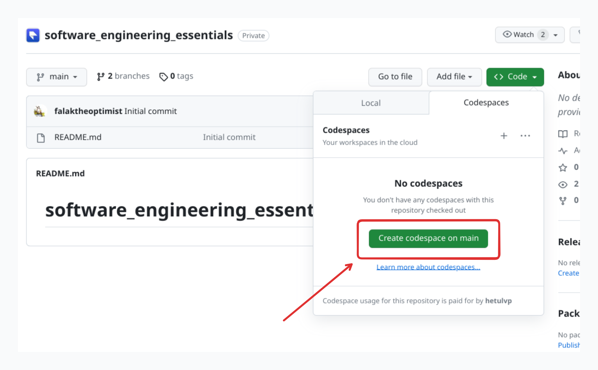
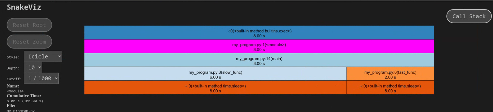
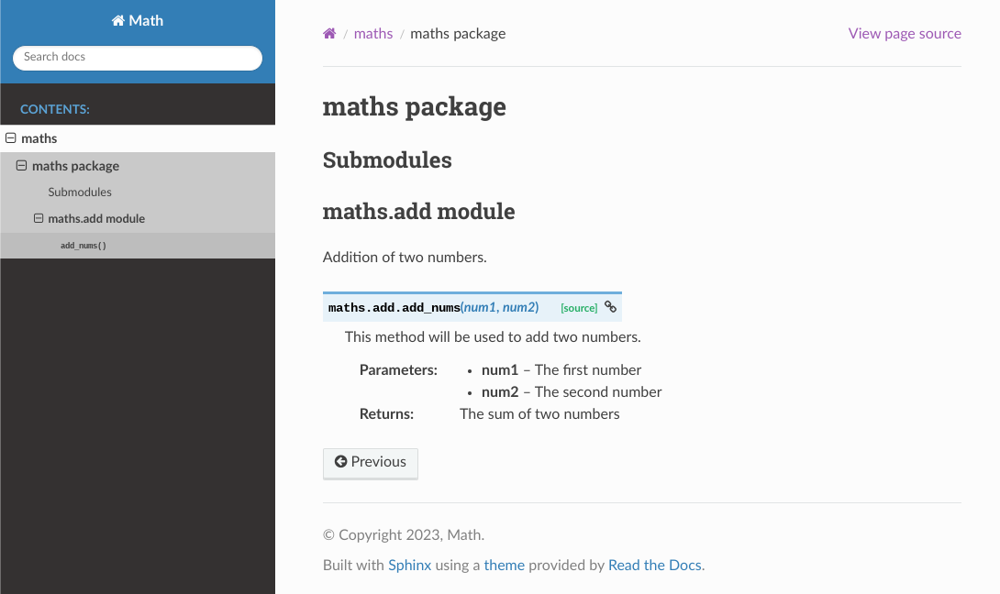

# Software Development Essentials

This is a comprehensive guide that covers a range of important topics and tools for professional software developers. It includes best practices for code profiling, debugging, contributing code, testing, code auto-formatting, spell checking, documentation, and automation using precommit hooks. 

!!! note
    Python is used as an example in this blog, but you can apply these concepts to any widely used programming language for development.

## 1. Remote First Development

!!! tip
    Say goodbye to running code locally 👋 !! 

| Remote Development | Local Development |
| --- | --- |
| Accessible from anywhere with an internet connection | Limited to local machine |
| Facilitates collaboration and teamwork with built-in features | Collaboration requires manual coordination |
| Provides a consistent development environment across team members | Environment may vary across different machines |
| Isolated from local machine, reducing conflicts and dependencies | Prone to conflicts and dependency issues |
| Offers scalability with adjustable resources | Limited by local machine's resources |
| Seamlessly integrates with version control systems like Git | Requires separate setup for version control |

For example, you can open any GitHub repository in **GitHub Codespaces** by just clicking **“Create codespace on master”** as shown below.



Here is the list of recommended remote development platforms.

- [GitHub Codespaces](https://github.com/features/codespaces)
- [AWS Cloud9](https://aws.amazon.com/cloud9/)
- [Project IDX](https://idx.dev/)

## 2. Contributing to the Code

!!! tip
    ***Fork and Pull*** is all you need !!


It's an ideal way to follow a ["fork and pull request"](https://docs.github.com/en/get-started/quickstart/contributing-to-projects) workflow when you are contributing to a collaborative project. For example, you can follow these steps to contribute to any open-source project on GitHub.

- Fork the project on GitHub.
- Clone your forked repository to your local machine.
    - `git clone [https://github.com/](https://github.com/)<your-username>/<repository>.git`
- Create a new branch for your feature or bug fix.
    - `git checkout -b <branch-name>`
- Make and commit your changes.
    - `git add .` and `git commit -m "Your commit message here"`
- Push your changes to your fork on GitHub.
    - `git push origin <branch-name>`
- Create a pull request from your branch to the original project.

While fork and pull request model is specific to GitHub, many managed version control systems uses similar workflows for collaborative development. Here are some additional platforms that support collaborative development workflows similar to the "fork and pull request" model:

- [GitLab](https://about.gitlab.com/)
- [Bitbucket](https://bitbucket.org/)

## 3. Managing Dependencies

!!! tip
    If the code works for you, Nice 👍 But If the code works for everyone, Great 👏!!


Managing dependencies of a project is crucial because it ensures that the project's external libraries and components are correctly integrated, up-to-date, and compatible with each other. Package managers, such as npm for JavaScript or pip for Python, simplify this process by automating the installation, version control, and resolution of dependencies.

### Start simple !!

Just create a `requirements.txt` file in the root folder of your python project and list down all the dependencies as shown here. Then run `pip install -r requirements.txt` to install all of them in any machines. That’s cool 😎!! 

```js
Flask==2.3.3
tensorflow==2.13.0
```

### Keep up with the trend !!

Pip serves as a basic tool for managing Python package dependencies, while Poetry offers a modern and comprehensive solution that streamlines the entire Python project management process, including dependency management, packaging, and version control. [Poetry's](https://python-poetry.org/) popularity is growing, and it simplifies dependency installation with a single command (**`poetry install`**) from the project's root directory.

## 4. Testing

!!! tip
    “Writing tests before the code 💯” : Mantra for Test Driven Development (TDD).

### Unit Tests

Unit tests cover modular logic that does not require call to outside APIs. If you add a new logic, please add a unit test. We can use python’s inbuilt `unittest` library to write unit tests as shown below. 

```python title="basic_algebra.py" linenums="1"
"""File containing basic algebraic operations."""

def add(a, b):
    """Adds two numbers."""
    return a + b

def subtract(a, b):
    """Subtracts two numbers."""
    return a + b  # See the bug? Check coverage section. 
```

```python title="basic_algebra_test.py"
"""Unit tests for addition function."""
import unittest
import basic_algebra

class TestAddition(unittest.TestCase):
    def test_add_positive_numbers(self):
        result = basic_algebra.add(2, 3)
        self.assertEqual(result, 5)

if __name__ == '__main__':
    unittest.main()
```

You can directly run unit tests using this command: 

```bash
python basic_algebra_test.py
```

Sample Output:

```bash
# Output
# .
# ----------------------------------------------------------------------
# Ran 1 test in 0.000s

# OK
```

### Automated testing

In a real world project, we have lots of test files and we certainly don’t  want to run them individually.  Make sure the files end with `test.py`  and method starts with `test_`.

Simply run this command from the project’s root directory. 

```bash
pytest .
```

 See how it also runs test files from the sub directories. 

```bash
============ test session starts ===================================
platform linux -- Python 3.10.8, pytest-7.4.2, pluggy-1.3.0
rootdir: 
plugins: anyio-4.0.0, cov-4.1.0
collected 2 items                                                   

basic_algebra_test.py .                                       [ 50%]
nested_dir/nested_test.py .                                   [100%]

============= 2 passed in 0.02s ====================================
```

### Coverage

Code coverage (i.e. the amount of code that is covered by unit tests) helps identify areas of the code that are potentially more or less brittle.

After installing `pytest-cov`, run tests with coverage:

```bash
pytest --cov --cov-report term-missing
```

You can see that the coverage report tells us that we missed writing a test for the `subtract` method at line number 9.

```bash
======================== test session starts ========================
platform linux -- Python 3.10.8, pytest-7.4.2, pluggy-1.3.0
rootdir: 
plugins: anyio-4.0.0, cov-4.1.0
collected 1 item

basic_algebra_test.py .                                        [100%]

---------- coverage: platform linux, python 3.10.8-final-0 ----------
Name                                    Stmts   Miss  Cover   Missing
---------------------------------------------------------------------
basic_algebra.py                            4      1    75%   9
basic_algebra_test.py                       8      1    88%   11
---------------------------------------------------------------------
TOTAL                                     112     97    13%

========================== 1 passed in 0.03s ========================
```

## 5. Code Profiling

!!! tip
    Put your code on turbo booster 🚀!!

Let's say you are writing a code, and it seems to run slower than expected or consumes more resources than it should. In such cases, code profiling becomes crucial as it allows you to pinpoint exactly which parts of your code are causing performance issues, helping you make informed optimizations to deliver a more efficient and responsive application.

### Time: ***Benchmark Short Code Snippets***

In Python, the most basic form of profiling involves measuring the code execution time by calling one of the [timer functions](https://realpython.com/python-timer/) from the [time](https://realpython.com/python-time-module/) module:

```python title="my_program.py"
import time

def slow_func():
    print("Slow function running!!")
    my_code = 5+5
    time.sleep(6) # Sleep for 6 seconds

def fast_func():
    print("Fast function running!!")
    my_code = 5+5
    time.sleep(2) # Sleep for 2 seconds

def main():
    start = time.time()
    fast_func()
    slow_func()
    print(f"{(time.time() - start)} seconds")

if __name__ == '__main__':
   main()
```

Sample Output:

```bash
Fast function running!!
Slow function running!!
8.000357627868652 seconds
```

### cProfile: ***Collect Detailed Runtime Statistics***

[cProfile](https://docs.python.org/3/library/profile.html) is a built-in Python module used for performance profiling. It allows developers to analyze the execution time of individual functions and method calls within their code, helping identify bottlenecks and areas for optimization, making it a valuable tool for optimizing Python applications.

To profile a specific file using `cProfile` run below command which generates a [program.prof](http://program.prof) output file.

```bash
python -m cProfile -o program.prof my_program.py
```

We visualize the output of cProfile suing [snakeviz](https://jiffyclub.github.io/snakeviz/) by running below command.

```bash
snakeviz program.prof
```

Sample Output:



## 6. Code Debugging

!!! tip
    Finding a needle in a haystack 🤯

Often times, we encounter unexpected issues, errors, or undesirable behavior while developing software. Debugging is the crucial process of systematically investigating and rectifying these problems, ensuring that our code functions as intended and meets quality standards.

### Python Debugger

**[pdb](https://docs.python.org/3/library/pdb.html)**  is a built-in interactive debugging tool for Python that allows developers to step through code, inspect variables, and diagnose issues in real-time, aiding in the debugging process.

For example when this run file, it will pause the execution just after calculating the result. 

```python
import pdb

def divide(x, y):
  result = x / y
  pdb.set_trace() # Start debugging from here
  return result

result = divide(10, 2)
```

Sample input and outputs.

```bash
(Pdb) x
10
(Pdb) y
2
(Pdb) result
5.0
```

## 7. Following a consistent code style

!!! tip
    Wear your own style 😎

**Programming style**, also known as **code style**, is a set of rules or guidelines used when writing the source code. It generally helps other programmers read and understand your source code conforming to the style, and help to avoid introducing errors.  To start with you can follow **[Google Python Style Guide](https://google.github.io/styleguide/pyguide.html#s3-python-style-rules).**  

Let’s see an example of formatting the imports. Imports should be on separate lines; there are [exceptions](https://google.github.io/styleguide/pyguide.html#typing-imports) for `typing`  and  `collections.abc`  imports.

```python
Yes: from collections.abc import Mapping, Sequence
     import os
     import sys
     from typing import Any, NewType
```

```python
No:  import os, sys
```

## 8. Linting

!!! tip
    Meet your personal code-proofreader 🧐 !!

While it's a good idea to follow a consistent coding style, it's not usual for the human brain to remember all the rules while writing the code. Don't worry; a linter is a program that automates the process of checking your code against coding style guidelines.

To check all the styling issues, run the `pylint` command.

```bash
pylint .
```

Sample Input

```python title="app.py"
import os, sys
```

Sample Output

```bash
************* Module app
app.py:1:0: C0304: Final newline missing (missing-final-newline)
app.py:1:0: C0114: Missing module docstring (missing-module-docstring)
app.py:1:0: C0410: Multiple imports on one line (os, sys) (multiple-imports)
app.py:1:0: W0611: Unused import os (unused-import)
app.py:1:0: W0611: Unused import sys (unused-import)

-----------------------------------
Your code has been rated at 0.00/10
```

!!! tip
    ## 9. Code Auto-Formatting

Oh I can fix that easily 💁‍♂️ !!

While linters are good at finding code style-related mistakes in the code, formatters go a step further by automatically fixing those style issues, ensuring code consistency and reducing manual effort in code maintenance.

We can use [YAPF](https://github.com/google/yapf) to automatically fix styling errors by running below command.

```bash
yapf -i my_code.py
```

An example of the type of formatting that YAPF can do, it will take this ugly code:

```python title="my_code.py"
x = {  'a':37,'b':42,

'c':927}

y = 'hello ''world'
z = 'hello '+'world'
a = 'hello {}'.format('world')
class foo  (     object  ):
  def f    (self   ):
    return       37*-+2
  def g(self, x,y=42):
      return y
def f  (   a ) :
  return      37+-+a[42-x :  y**3]
```

and reformat it into:

```python title="my_code.py"
x = {'a': 37, 'b': 42, 'c': 927}

y = 'hello ' 'world'
z = 'hello ' + 'world'
a = 'hello {}'.format('world')

class foo(object):
    def f(self):
        return 37 * -+2

    def g(self, x, y=42):
        return y

def f(a):
    return 37 + -+a[42 - x:y**3]
```

## 10. Documentation

!!! tip
    Please have some empathy  🙏!!

Maintaining good documentation of the code is essential for enhancing code understandability, facilitating collaboration, and ensuring long-term maintainability of the software.

### General Documentation

We can utilize [Docusaurus 2.0](https://docusaurus.io/) to create comprehensive project documentation. 

Docusaurus streamlines the process of creating and maintaining documentation websites by automatically generating static sites from the Markdown content we provide. Furthermore, it effortlessly infers the sitemap from directory structures, enhancing the efficiency of the documentation development process.

Look at this example how Docusaurus generates a static site from markdown files.

.png)

### Auto-Generated API Docs

Use [Sphinx](https://www.sphinx-doc.org/en/master/usage/quickstart.html) to generate API documentation from docstrings in your code:

```bash
sphinx-quickstart  # Follow the setup prompts
sphinx-apidoc -o docs maths/  # Generate API documentation
PYTHONPATH=. sphinx-build -b html docs/ docs/_build  # Build HTML documentation
```

These sample inputs and outputs provide a clear picture of how these tools and best practices can be applied and what results to expect.

Sample input:

```python
"""Addition of two numbers."""

def add_nums(num1, num2):
    """This method will be used to add two numbers.

    Args:
        num1: The first number
        num2: The second number

    Returns:
        The sum of two numbers
    """
    answer = num1 + num2
    return answer
```

Sample Output:



## 11. Automation Before Committing: Pre-commit Hook

!!! tip
    Let me do that all for you ✅

No need to run all these commands manually. One powerful way to enforce coding standards, run tests, and perform various checks before committing your code is by using a precommit hook.

A precommit hook is a script or set of scripts that automatically run before a commit is allowed. Here's how you can set it up:

1. In your project directory, create a configuration file named `.pre-commit-config.yaml`. This file defines the hooks and checks that should run before each commit.
    
    ```yaml
    default_stages: [commit, push]
    repos:
    - repo: local
     hooks:
     - id: pytest
       name: pytest
       entry: pytest
       args: ['--cov-report=term-missing', '--cov=search', '--cov-fail-under=50']
       language: system
       always_run: true
       pass_filenames: false
    ```
    
2. Run the following command to install the precommit hook in your local Git repository:
    
    ```bash
    pre-commit install
    ```
    

Now, before each commit, the configured hooks will automatically check your code. If any checks fail, the commit will be rejected, ensuring that only code that passes these automated checks is committed to the repository.

## Conclusion

In conclusion, this guide highlights key practices and tools vital for software development, encompassing remote-first collaboration, dependency management, effective testing, code optimization, debugging, code style adherence, automation, and robust documentation. By embracing these practices and tools, developers can elevate their coding proficiency and streamline their workflows across programming languages, fostering more efficient software development processes.