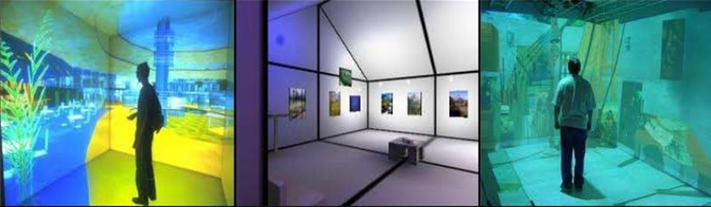
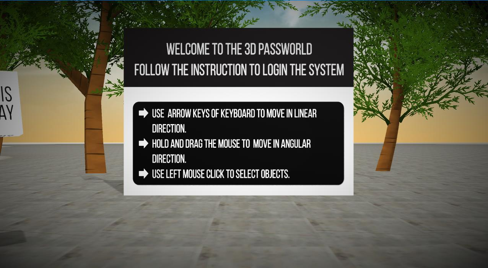
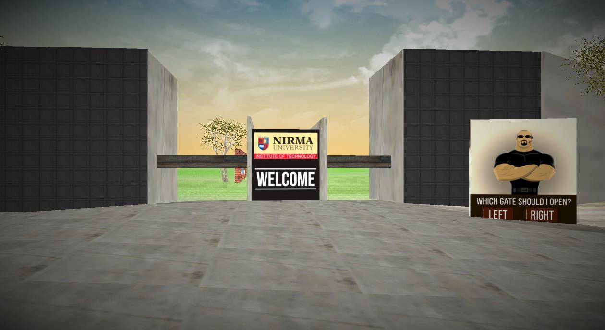
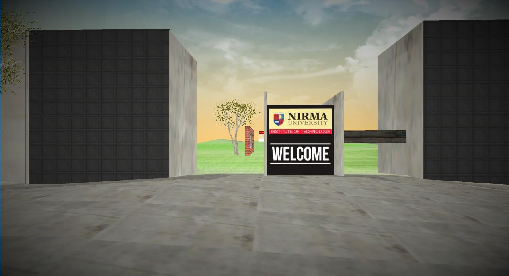
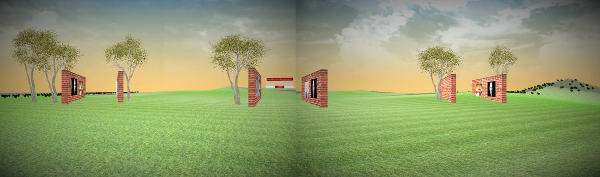
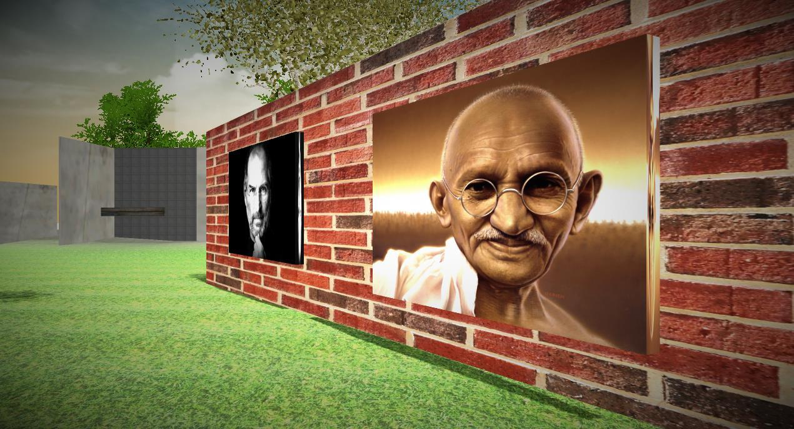
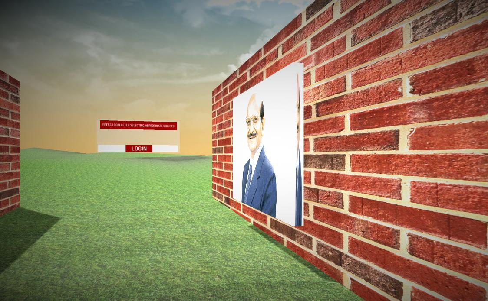
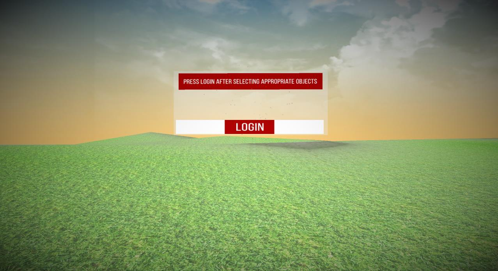
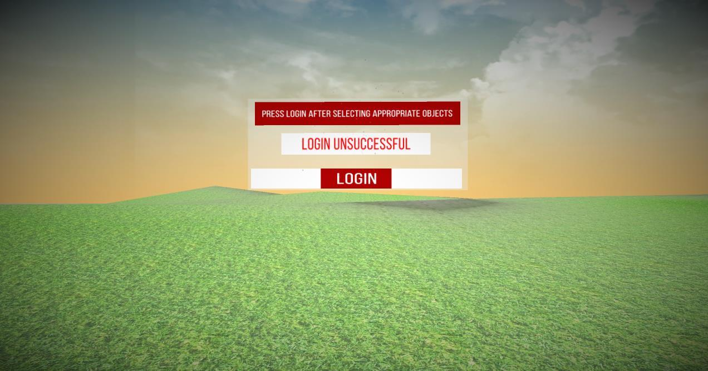

# 3D Password

## Introduction

3D password is an advancement in the field of user authentication techniques. 3d password can have large number of possible combinations as integration of textual, graphical and biometric. So it is technically very hard to crack the one. 3d password is setup in any computer screen which includes a virtual environment where user can set different objects as password. 

Below is the list object which can be used
as 3D password,

1. An Iris Scanner
2. A Fingerprint Scanner
3. A Virtual ATM machine that requires real ATM card
4. A text input device which take input
5. Photo album as pictorial password

So any real world object can be integrated in the 3D environment and any
new authentication technique can also be included if it is invented after.

## Working of 3d environment
Every object in a 3D environment has its unique `(x,y,z)` coordinates. If the
size of the 3D world is `M x M x M` then the entire virtual world can be
represented by `[1,2,3......, M] x [1,2,3......, M] x [1,2,3......, M]`. User can
move in the 3d environment using mouse and keyboard. Also biometric
scanners, stylus pen and ATM card reader can be attached for interactions
with virtual models of it. The coordinates are stored when any interaction is
performed with the object. E.g. user opens a door located at `(10,15,60)`,
He closes the door and enters the office. Take a marker located at
`(25,20,70)` and write `“Hello”` on the white board located at `(25,52,80)`. This
interaction is stored as 3D password as follows:

1. **(10,15,60)** Object: door Action: Opening the door,
2. **(10,15,60)** Object: door Action: Closing the door,
3. **(25,20,70)** Object: marker Action: Take the marker,
4. **(25,52,80)** Object: white board Action: Writing “H”,
5. **(25,52,80)** Object: white board Action: Writing “E”,
6. **(25,52,80)** Object: white board Action: Writing “L”,
7. **(25,52,80)** Object: white board Action: Writing “L”,
8. **(25,52,80)** Object: white board Action: Writing “O”.

## Implementing 3D Password

3D password implementation requires the integration of software and hardware.
3D objects can be designed in 3D modelling software such as Adobe Maya, Blender
etc. This 3D objects are imported in a 3D world which can be created in gave
development software like UNITY 3D. The Serial Input and Output can be driven
through USB port. I have implemented small 3D Password using UNITY 3D. The
steps are as follows:

#### Step 1: Read all the instructions carefully.

Figure 4.1 shows the instruction to be followed to travel in the 3D world. Use
Keyboard direction keys to move in linear direction and mouse to move in angular
direction.

#### Step 2: Open the Right or Left gate to enter into the Nirma’s Gate.

As shown in figure 4.2 You will see the entrance gate of Nirma. User has to go
Security guard and use the mouse to click on LEFT or RIGHT button to open the
left or right gate respectively. As The password is predefined here I’ll open the
LEFT gate as shown in fig 4.3 and enter into the college.

#### Step 3: Go to correct colony and choose correct photo frame.

As shown in figure 4.4, You will see 3 identical colonies with same photo frames
hanged on the walls. The difference is that each colony has different number of
trees near it. We will go first the colony which has 3 trees near it

As shown in figure 4.5 there are 4 photo frames hanged on the wall from the left

1. Steve jobs
2. Mahatama Gandhi
3. Karsanbhai Patel
4. Bill Gates

I will select the Mahatama Gandhi photo frame by clicking on it. The photo will
come forward as selected as shown in figure 4.6

Then I’ll go to the another colony with two trees. And select the Karsanbhai patel’s
photo frame as it is my predefined password.

#### Step 4: Click the login button to get the access.

After performing the correct sequence of interactions, I will go to the last stage of
my password where I click the login button as shown in figure 4.8. Now If all the
actions are correctly performed, I will be logged into the Nirma University System
as show in figure 4.9. Else it will show me an Invalid password error as shown in
figure 4.10.

