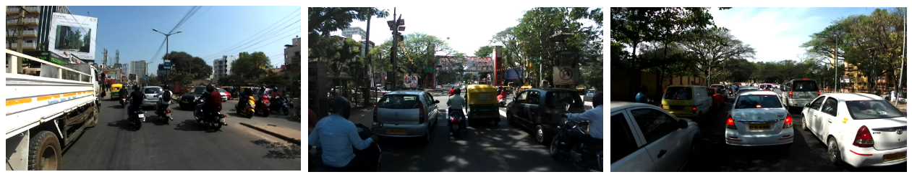

# Automatic License Plate Recognition

## Introduction

ALPR/ANPR is an algorithm to recognize the digits of a vehicle number plate using its image. Even though this problem seems a simple optical character recognition task, many traditional solutions fail to achieve good results in real-world conditions as shown below. I developed a custom Deep Learning based solution that not only works with these cases but is also fast enough to deploy on edge devices. I broke down this task into two subtasks, license plate detection, and recognition.

## License Plate Detection

In the first phase, we need an object detection model which can retrieve the bounding box coordinates of a license plate in the input image. 

### Dataset Collection

Since the challenge was to build this model for real-world images, I needed a dataset that has variations in vehicle type, plate type, location of plate, size, shape, etc. I collected a large number of vehicle images and hand-annotated bounding boxed for license plates. Some of the sources I used for collecting data are listed below,

* **OpenSource Datasets**: I merged all available open-source plate detection datasets which I found such as [Cars](https://ai.stanford.edu/~jkrause/cars/car_dataset.html), [CCPD](https://github.com/detectRecog/CCPD) etc. into a large collection of the labeled dataset.

    
* **Active learning**: I trained my initial model on all the readily available annotated images. Then used this model to generate labels for unknown images and corrected the annotations manually. This way I was able to label a large number of unlabelled images quickly. For active learning, I developed a custom annotation tool using javascript to adjust bounding boxes.

    

Some of the unlabelled datasets used for active learning are as follows,

* **Google images**: Vehicle images with visible license plates from google search.

* **Youtube videos**: A large number of channels live stream traffic or street view cameras 24/7 on YouTube. I collected a large number of frames containing vehicles by running a vehicle detection model on it.

    

* [**India Driving Dataset**](https://idd.insaan.iiit.ac.in/dataset/details/): Around 10k Indian street view images captured from a front-facing camera attached to a car.

    

### Modeling

I used [tensorflow-yolov3](https://github.com/YunYang1994/tensorflow-yolov3) repo to train my custom yolov3 model. YoloV3 is a single-shot detector that can detect objects of multiple scales in a single pass. I made a couple of modifications as per my use-case as below,

* Since I only needed to predict a single class, I reduced the number of channels for each layer by at least 8x. This way I was able to fit my model on edge devices.
* I used multiscale training where instead of training the model on a fixed input resolution, we choose a random input resolution for each batch. e.g I trained my model on batches varying in input resolutions from 128x128, 256x256, 512x512, and 768x768 pixels. This way I could use the same model for different input sizes based on latency requirements as higher resolution takes more inference time.
* For the prediction layer, I used the encoding method proposed by the [SSD paper](https://arxiv.org/abs/1512.02325) since the TensorFlow-lite library has an inbuilt Op called `TFLite_Detection_PostProcess` for SSD style decoding and NMS, and thus it was easy to convert the entire model to tflite format later for edge deployment.
* For bounding box regression I used [Generelized IOU](https://giou.stanford.edu/GIoU.pdf) loss instead of standard box regression and for classification, I used the [Focal Loss](https://arxiv.org/abs/1708.02002) to tackle the class imbalance problem.
* For data augmentation, I used [imgaug](https://imgaug.readthedocs.io/en/latest/source/examples_bounding_boxes.html) library which preserves the location of the bounding box after applying affine transformations.
* Apart from standard augmentations, I designed a scale-oriented augmentation in which we choose a random bounding box from the image and randomly crop 10-90% image around it. This way we make sure our model sees all the different scales of the license plate. 

## Polygon detection

Our license plate detection model only predicts rectangular bounding boxes. For recognition, we need to correct issues like rotation and skewness using a perspective transformation as shown below. For this, we need the coordinates of the 4 corners. 

### Dataset Collection

* I used [CCPD](https://github.com/detectRecog/CCPD) dataset as it contains polygon annotations for license plates.
* The CCPD only contained blue color Chinese number plates. To generalize better, I replaced the original plate images with other country number plates using OpenCV's [perspective transform](https://www.geeksforgeeks.org/perspective-transformation-python-opencv/).

### Modeling

* I trained a very small CNN model which directly regresses these 8 values (x and y coordinates of all the 4 points) given a crop of license plates. 
* Additionally, I predicted the probability of the license plate filtering out false positives. 
* I used [wing loss](https://arxiv.org/abs/1711.06753) instead of standard MSE loss to weigh hard examples more compared to the easier ones.

## License Plate Recognition

After detecting and correcting the angle and skewness of the license plate, in the third stage, we need to extract the license plate number from the crop. The license plates can be single lines or multi-line. Also, the variability in lighting conditions, background noise, fonts and font size, etc. results in very poor recognition accuracy for standard image processing-based approaches. So I trained a model which can predict both single and multiline license plates directly from the RGB image crop.

### Dataset collection
* Similar to the detection task, I started with CCPD and other open-source datasets which contained string-level annotations for plate images.
* Then used an active learning technique to iteratively predict and refine labels for unlabelled images to increase the dataset size. With active learning, I was able to collect around 30k labeled license plate crops.
* The problem with this data was the class imbalance at the character level. Since the model does not see all the characters equally, it misclassified low-frequency characters often. E.g. 0<->8, 1<->7 etc. To overcome this issue, I synthetically generated license plate images with different backgrounds and styles keeping the total frequency of each character equal across the entire dataset. I used this data to train the model from scratch and then finetuned it with real data which increased the overall accuracy by more than 20%.
* I also designed a 3D version of an Indian license plate in a blender similar to as shown below and rendered different views of it by changing characters for every render using python and blender integration. This way I was able to improve the model's accuracy on country-specific plates.

    

### Modeling

* I designed a custom CNN + [CTC decoder](https://distill.pub/2017/ctc/) based model for recognition.
* The input of the model was semi-rectangular (width 128 and height 256) such that we can fit both single and multiline number plates in the input placeholder padded by zeros.
* The model extracts features from the upper and lower image and then concatenates both in a single row such that we have an output of shape (H:1, W:64, C:37). Channels refer to the number of possible characters for each position and 64 is the maximum string length the model can predict.
* CTC loss was used to directly train the model on unaligned image-and-text pairs. The model learns to output one character for every 64 positions such that the final string matches our desired string by predicting other characters as blank.
During inference, the CTC beam search decoder was used for better accuracy.
* I implemented my [own CTC decoder](https://github.com/hetul-patel/ctc_beam_search_decoder) in C++ with a python wrapper as frameworks like TensorflowLite and OpenVINO did not support the beam search decoding op for edge deployment.

## Evaluation
To test the model's performance with existing solutions I compared my model to two openly available commercial solutions on Indian and mix country number plates.

1. [Plate Recognizer](https://platerecognizer.com/): The model was able to achieve higher accuracy for both detection and recognition tasks compared to results extracted from the plate recognizer's online demo.
late recognizer solution.
2. [OpenALPR Benchmark](): This company published a benchmark of 100 challenging images on which the model was able to achieve 98% accuracy.  

## Deployment

I used different frameworks to deploy the same model based on hardware specifications. Some of the frameworks I used are listed below. The challenge was to use only supported ops and maintain accuracy after conversion from TensorFlow to custom frameworks. 

* [NVIDIA TensorRT](https://developer.nvidia.com/tensorrt): For GPU-enabled server deployment, I converted my model to TensorRT plan files. This reduced float32 to float16 and significantly improved inference speed.
* [Intel OpenVino](https://www.intel.com/content/www/us/en/developer/tools/openvino-toolkit/overview.html): For intel's CPU-based server deployment, I converted my model to OpenVino's intermediate format. This reduced float32 to int8 using inbuilt quantization with a fallback to float32.
* [TensorFlow Lite](https://www.tensorflow.org/lite): For edge devices such as raspberry-pi and smartphones, I used TensorFlow lite to deploy my model.

I used C++ to write a modular backend where image reading, preprocessing and post-processing functions were common. While the actual inference class was an abstract class implemented for every hardware using framework-specific methods. It is easy to compile and distribute models in form of a C++ SDK and then to write separate code for each hardware. 

