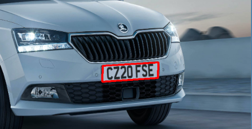
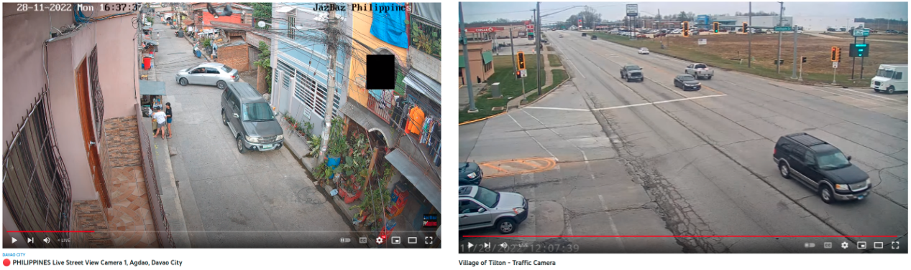

# Automatic License Plate Recognition

## Introduction

ALPR/ANPR is an algorithm to recognize the digits of a vehicle number plate using its image. Even though this problem seems a simple optical character recognition task, many traditional solutions fail to achieve good results in real-world conditions as shown below. I developed a custom Deep Learning based solution that not only works with these cases but is also fast enough to deploy on edge devices. I broke down this task into two subtasks, license plate detection, and recognition.

## License Plate Detection

In the first phase, we need an object detection model which can retrieve the bounding box coordinates of a license plate in the input image. 

### Dataset Collection

Since the challenge was to build this model for real-world images, I needed a dataset that has variations in vehicle type, plate type, location of plate, size, shape, etc. I collected a large number of vehicle images and hand-annotated bounding boxed for license plates. Some of the sources I used for collecting data are listed below,

* **Google images**: Vehicle images with visible license plates from google search

* **Youtube videos**: A large number of channels live stream traffic or street view camera 24/7 on YouTube. I collected a large number of frames containing vehicles by running a vehicle detection model on it.

    

* **OpenSource Datasets**: I merged all available open-source plate detection datasets which I found such as [Cars](https://ai.stanford.edu/~jkrause/cars/car_dataset.html), [CCPD](https://github.com/detectRecog/CCPD) etc. into a large collection of the labeled dataset.

* [**India Driving Dataset**](https://idd.insaan.iiit.ac.in/dataset/details/): Around 10k Indian street view images captured from a front-facing camera attached to a car.

    

    
* **Active learning**: I trained my initial model on all the readily available annotated images. Then use this model to generate labels for unknown images and correct the annotations manually. This way I was able to label a large number of unlabelled images quickly. For active learning, I developed a custom annotation tool using javascript to adjust bounding boxes.

    

<!-- polygon prediction

recognition
    data preparation (indian images)
    data augmentation (blender, augmentation)
    semi supervision
    model (CNN + CTC)
    evaluation
 -->
