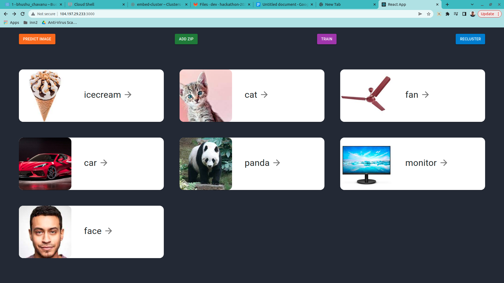
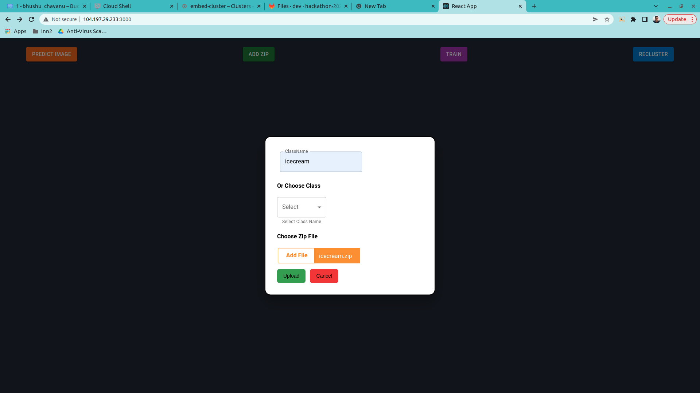
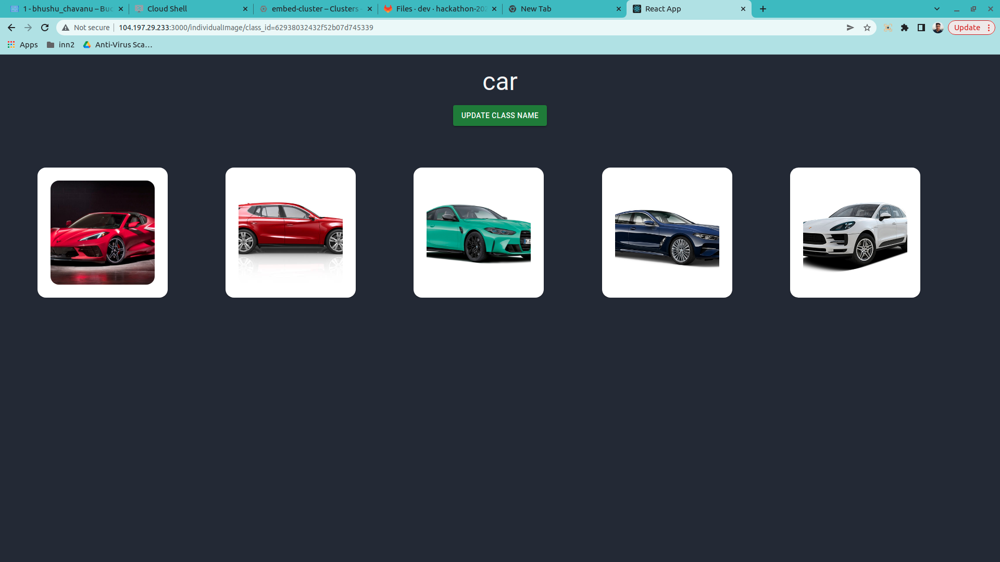
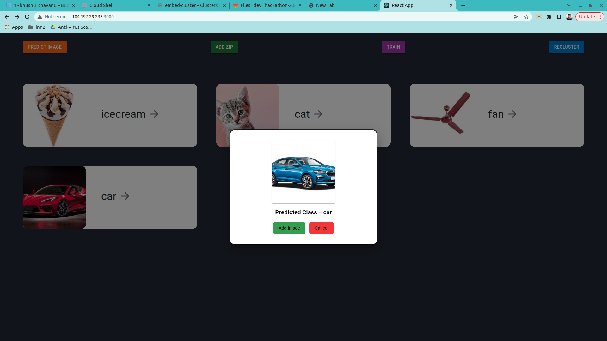
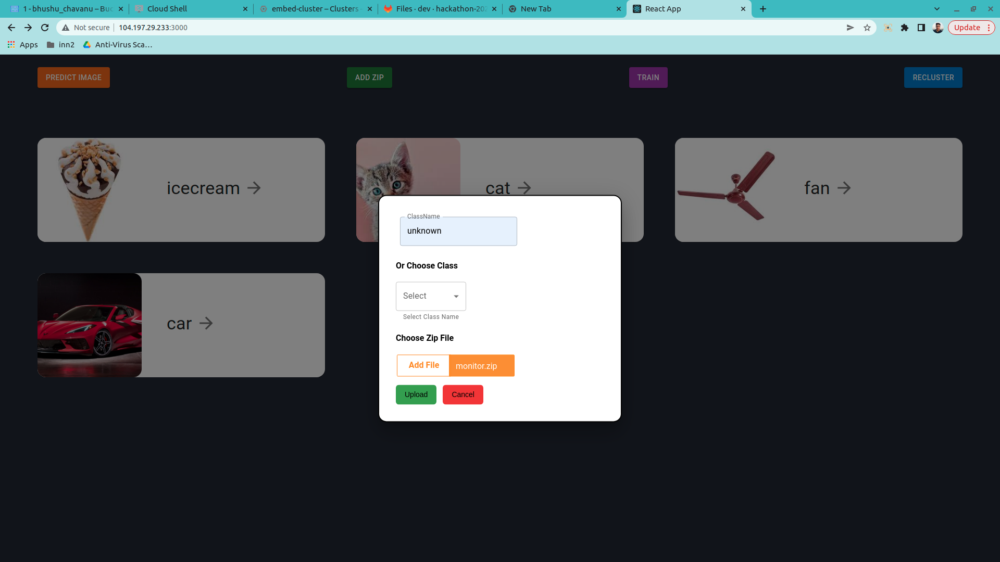
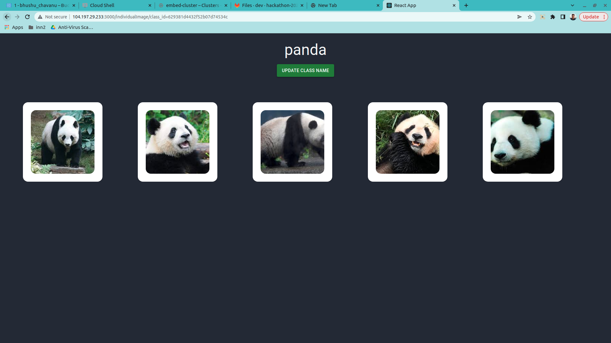
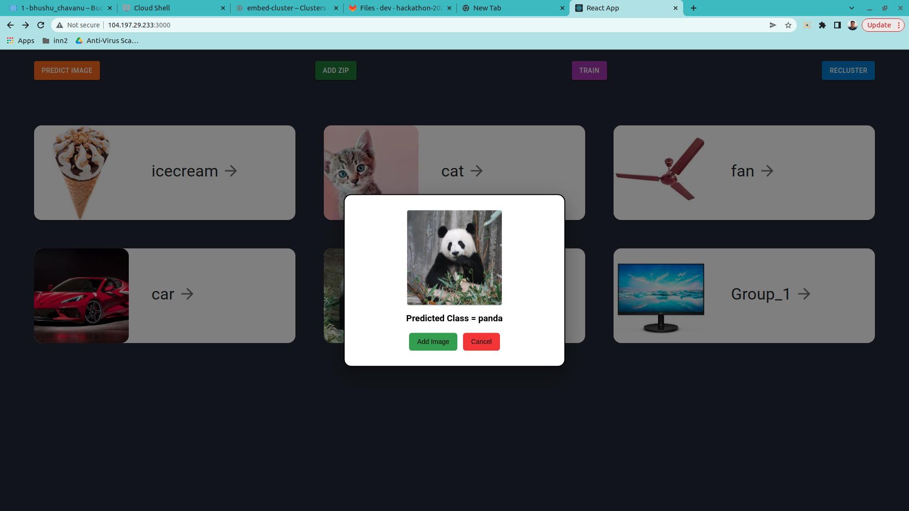
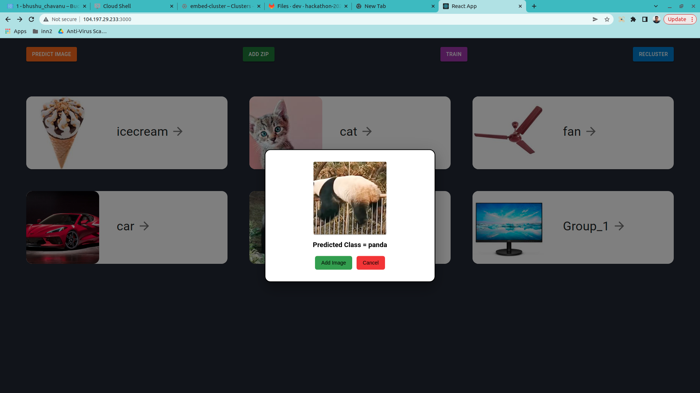

# Auto Adaptive Image Classifier

Platform similar to google photos which can group similar looking images into albums and can predict labels for the unknown images. Starting with zero known labels, the AI can learn to recognize many different classes on the fly as in when new labelled examples are added.

## Functionalities

### HomePage

* GridLayout which shows different classes

### Add Zip for one class

* Defines popup which takes zip from user and class label to add multiple images with labeled class in database

### View Individual class Images
* Click on class card to view images for that class
* We can also update the name of class from here

### Predict Image
* Defines popup which ask image input from user (only png and jpg allowed) and predict class from existing classes then user can give choice of add predicted label to given image or not

E.g. We have 5 car images in the database and we will test on unknown car image.

Model predicted below out of training image correctly as a car.

### Add unknown class
* We can add a new class without any label. These can be out of distribution images,

### Recluster
* When we click on recluster button, all unknown images are grouped together by their visual similarity.

### Add group to known classes
* We can add goup_0 to human verified classes by updating its name.

### Train on new images
* To automatically adapt newly added classes we can click the train button.
* Auto adapts new verified classes.

We can see two pandas images are correctly classified which are not part of training.

### Predict out of distribution classes
* Classes which the model has never seen will be predicted as unknown.
* We have set a threshold for detecting unknown classes high so that precision can be higher compared to recall.
* Try with a few good quality images for known classes if unknown is suggested.

