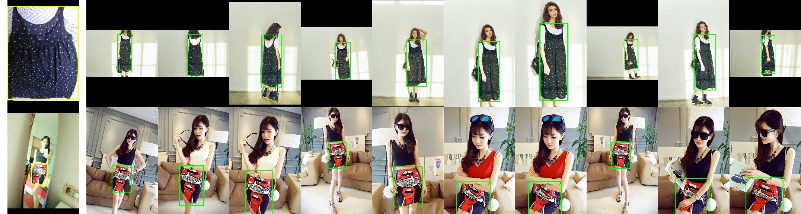
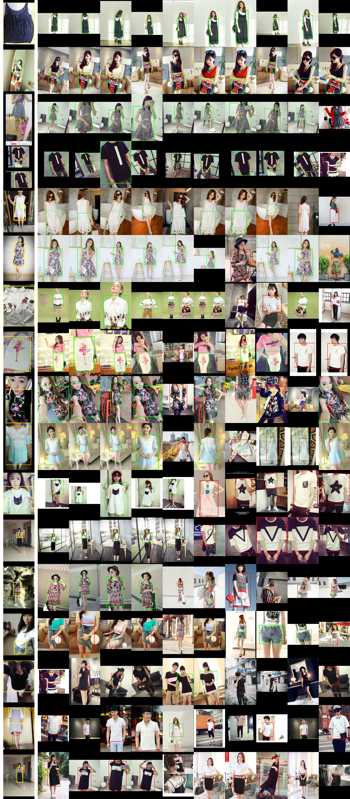

# Clothes Retrieval

Searching for exact cloth image accurately from massive collections of clothes' images based on a query image.

For example, here the left most image is the query image and other images are matched images retrieved from a huge collection of clothes using a computer vision algorithm.




## **Dataset Details**

* **Dataset used** : [Deep Fashion 2](https://github.com/switchablenorms/DeepFashion2)
* **Problem statement** : Consumer-to-shop **Clothes Retrieval**
* **Problem description**: Matching consumer-taken photos with their shop counterparts

## **Code**

<a href="https://colab.research.google.com/drive/1DyEZUDpnAjC2lyMUpSZgpWI4vAiAhwHg?usp=sharing" target="_blank">Google Colab</a>

## **Building the intuition**

<i>Sorted in the order of how I reached the solution</i>

### 1. Usecase understanding

* Consumer can upload a photo of clothing item 
* System should **retrieve similar looking items** from shopping catalog.

### 2. Dataset understanding

In the given task, we have two different **sources of data**. 

* **Consumer captured images :** 

These are **low quality** images captured using phone's camera (front or back). Images have **variation** in lighting, orientation, occlusion, filters etc.

* **Shop captured images :**

Shop images include **good quality** photo shoot quality images. It also includes images from online shopping carts where background is removed etc.


### 3. Real world challenges

* **Labeling** the dataset is major challenge
* Shopping image collection including online and offline stores can be **huge**
* Thousands of **unique clothing items**
* Manually **pairing** each user captured image to a similar shop image costs lots of **human effort**
* When the product is new, we might not have huge collection of user captured images. In that case the system cannot work better for **new styles**

## **Solving the problem**

Considering the **scarcity** of labeled consumer to shop pairs, I decided build **two stage pipeline**. First learning task agnostic **attributes** from raw data then use them to reduce consumer to shop **domain gap** using fewer labeled images.

### **Step 1** : Learning directly from raw images without labeling

**Observations**

* Humans are good at **pattern matching**. 
* We recognize many things from their **attributes**. For e.g we recognize a vehicle with wheels, seats, glasses, horn etc.
* We also use this attributes to distinguish between two different vehicles
* We learn about these attributes by **comparing between many instances** unconsciously

**Inspirations**

* Deep learning model can also learn similar attributes by just **observing** across different images
* In many image retrieval problems we consider output of pre-fc layer as **embedding**
* We use **metric learning** approaches such as triplet loss to lean **discriminative embedding**
* We can consider **each dimension** in embedding vector as one **attribute**
* This attributes make the embedding vector discriminative

**Difference from metric learning**

* Metric learning approaches try to increase distance between embeddings **as a whole**. For that we need **positive and negative pairs**.


* Instead we can **increase distance** between attributes of embedding **without labels**.
* Here, We do not try to teach **which attribute** represents **what**?
* We try to teach that **no two** attributes should represent **same concept**.

    

    

**Mathematical Formulation**

* We often calculate similarity of two vectors using **cosine similarity** measure.
* Cosine similarity has an interpretation as the cosine of the **angle** between the two vectors
* Cosine similarity is **not invariant to shifts**. If x was shifted to x+1, the cosine similarity would change.
    


* Unlike the cosine, the **correlation** is **invariant** to both scale and location changes of x and y.


* **Correlation** is the cosine similarity between centered versions of x and y


* In a **batch** of images, **attribute vector** represents values of **particular dimension** across all images
* For e.g if batch size = 512 and embedding dim = 2048, then we have 2048 attribute vectors each of length 512
* Now consider another batch of **slightly different** version of the same **images** in first batch.

**Our goal is to**

1. **Maximize** cosine similarity of **same attributes** in both batches
2. **Minimize** cosine similarity of **different attributes** in both batches

* Here, I used correlation as a **proxy loss** as both have same output range [-1,1]

**I divided loss function in two parts**

1. **Correlation** of attribute vectors at **same index** should be **1**. To make model generalize better I decreased the predicted correlation by **margin** m. For e.g if correlation is 0.9 we make it 0.6 so model tries to make it higher.
2. Correlation of attribute vectors at **different index** should be **0**.
3. Since there are **N^2-N** pairs of **different attribute** vectors I assigned **lower weight** compared to positive attribute pair. 

**Code for attribute loss**


```python
def attribute_loss(emb_1, emb_2, alpha=5e-4, margin=0.3):

    # per feature-dimension normalisation
    standardize = lambda x : (x - tf.reduce_mean(x, axis=0)) / tf.math.reduce_std(x, axis=0)
    emb_1_std = standardize(emb_1) # BxE
    emb_2_std = standardize(emb_2) # BxE
    
    # similarity of pairwise feature-dimension
    bsize = tf.cast(tf.shape(emb_1)[0], tf.float32)
    cos_t = tf.matmul(emb_1_std, emb_2_std, transpose_a=True) / bsize # Embed x Embed
    acos_t = tf.acos(tf.clip_by_value(cos_t, -1.0, 1.0))

    # diagonal values rep. expected similarity of same feature-dim
    same_dim_mask = tf.eye(emb_1.shape[1]) # Embed x Embed

    # non-diagonal values rep. expected similarity of different features-dim
    diff_dim_mask = 1.0 - same_dim_mask # Embed x Embed

    # increase angle betweem same feature-dims : Cos(angle + m)(i==j)
    cosine_same     = tf.cos(acos_t + margin)
    same_dim_loss   = tf.square(same_dim_mask - cosine_same) * same_dim_mask

    # decrease angle between different feature-dims : Cos(angle - m)(i!=j)
    # cosine_diff     = tf.cos(acos_t - margin)
    diff_dim_loss   = tf.square(same_dim_mask - cos_t) * diff_dim_mask

    # final weighted loss
    weighted_loss = tf.reduce_sum(same_dim_loss + diff_dim_loss * alpha)
    return weighted_loss
```

### **Step 2** : Reducing the domain gap using pinch of supervision

* Model trained with **attribute loss** can learn **diverse set of attributes** for each image.
* Although consumer and shop images have **inherent biases** due to different source of **data generation**
* This is very well known as **domain gap** where two similar objects can perceived differently by model due to pixel level differences
* I used **combination** of **attribute loss** and **instance loss** to reduce this domain gap with only **3 more epochs** for **finetuning**

**1. Attribute loss**:

* In stage one, attribute loss was calculated between **two different versions of same image** as we did not have any other information
* Here we calculate it between attributes of **same cloth type** but one image from **consumer** and other from **shop** using label information

**2. Instance loss**:

* Attribute loss encourages model to learn **features** which are **consistent** in consumer and shop domain
* Instance loss is normal classification loss which uses these attributes to **group similar** cloths in tight clusters and **increase distance** between other groups.
* I used **arcface** as an instance loss.

**3. Using weights from attribute model to**

1. Initialize **backbone**
2. Initialize weights of newly added **classification layer**.
* Arcface tries to reduce cosine similarity of **weights** vector and **instance** vector.
* I used **average** of all **embeddings** produced by unsupervised model for **each class** as the **initial weight** vector of that class.


**Code for classifier weights calculation**


```python
# Get classifier weights
def classifier_weights(dataset, model, num_class):
    # calculate avg embedding for each class as w_init for fc
    out_layer   = params.model.class_layer
    weights     = np.zeros(shape=(num_class, model.outputs[out_layer].shape[-1]),
                           dtype=np.float32) # (n_class, emb_dim)
    # (n_class,) extra 1 for ignoring zero div
    class_cnt   = np.ones(shape=(num_class,), dtype=np.float32) 
    for data in tqdm(dataset):
        user, shop, class_id = data
        all_images  = tf.concat([user, shop], axis=0)
        class_ids   = tf.concat([class_id, class_id], axis=0)
        embeds      = model(all_images, training=False)[out_layer].numpy()
        weights[class_ids] += embeds
        class_cnt[class_ids] += 1
    weights = np.divide(weights, class_cnt[:, np.newaxis])
    return weights
```

## **Experiments**

### Model details

* **Model** Resnet50
* **Batch Size** 512
* **Input resolution** 96
* **Embedding dimension** 2048

For training details refer code notebook

### Results

    


## **Final Comments**

* Although **unsupervised loss** has **lower accuracy** when source **domains are different**, it performs significantly **better** in **mix domain** (Exp 1 Last Block).
* Which suggests that **attribute loss** can work very well in **task agnostic** manner.
* Both **attribute loss** and fc7 **weights initialization** using avg class embedding **improves results**
* **Supervised training** from **scratch** performed significantly **worse** when training from scratch for **3 epoch**

## **Demo on validation dataset**

* No image was used during training
* Results are in **descending** order of **recall**
* **First** column is consumer **query** image
* **Other** columns are **retrieved** shop images
* **Green** box is **True Positive**, **Red** box is **False positive**

### **Model** :  Unsupervised Learning + Attribute Loss (Exp 1)

    


### **Model** :  Attribute Loss + Instance Loss + fc7 weights init (Exp-2)

    

