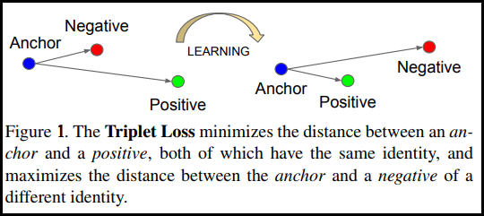
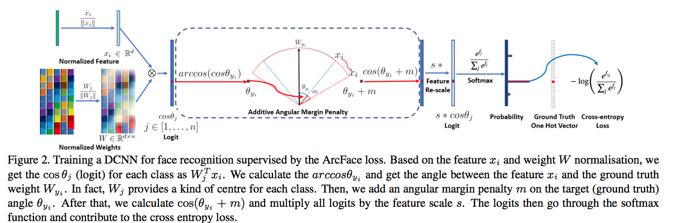
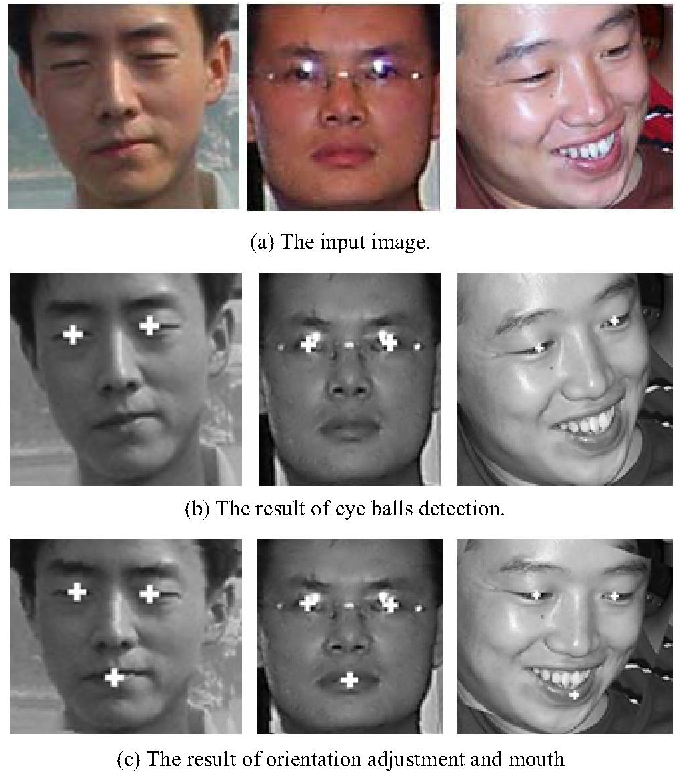
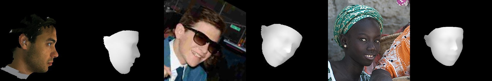
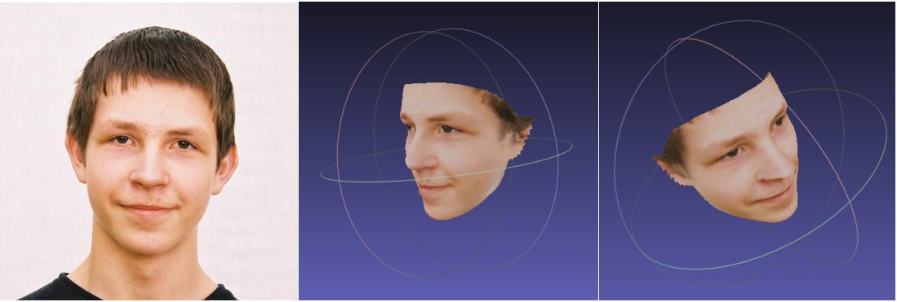
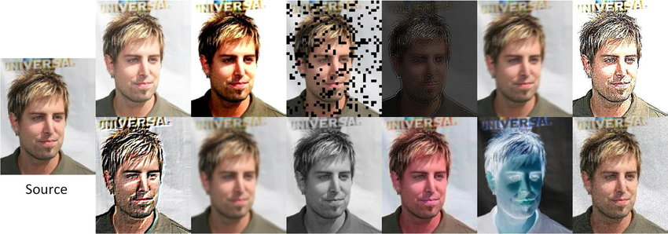

# Deep Face Recognition

## Introduction

Deep face recognition is the technique to identify the identity of a person using only facial images. Generally, a Deep Conv Neural Network (DCNN) is used for transforming an image into fix length high dimensional vector. We usually precompute the embeddings for all the people in our database using a few facial images per person and use it for matching it against an embedding of an unknown face image using distance metrics such as cosine similarity.

The accuracy of our model depends upon how well it can maximize the distance between two different person's face embeddings and minimize the distance between two face embeddings of the same person.

A standard approach is to train our model using [triplet loss](https://arxiv.org/pdf/1503.03832.pdf) where for each image we prepare a positive image that belongs to the same person and a negative image that belongs to a different person. Although there is a combinatorial explosion in the number of face triplets especially for large-scale datasets, leading to a significant
increase in the number of iteration steps. Technique such as Hard Negative Mining is used very often with triplet loss to generalize it for challenging face images. Though sampling is quite a hard problem.

## Arcface Loss

Instead of sampling triplets, I used the [Arcface loss](https://arxiv.org/pdf/1801.07698.pdf) which required no sampling at all. Arcface modifies the logit for the target class before calculating softmax cross-entropy loss, such that the model learns to form very close clusters for embeddings of the same class. Specifically, the dot product between the DCNN feature and the last fully connected layer is equal to the cosine distance after feature and center normalization. Arcface utilizes the arc-cosine function to calculate the angle between the current feature and the target center. Afterward, it introduces an additive angular margin
to the target angle, and we get the target logit back again by the cosine function. Then, it re-scales all logits by a fixed feature norm, and the subsequent steps are the same as in the
softmax loss. Due to the exact correspondence between the angle and arc in the normalized hypersphere, this method can directly optimize the geodesic distance margin, thus it is called as ArcFace.

## Datasets

### Training dataset

For the training, I mixed two datasets by removing overlapping identities using [a pretrained Resnet100](https://github.com/deepinsight/insightface/tree/master/model_zoo) model.

1. [MS-Celeb-1M](https://paperswithcode.com/paper/ms-celeb-1m-a-dataset-and-benchmark-for-large) - Around 5.1M images of 93K identities
2. [DeepGlint](http://trillionpairs.deepglint.com/overview) - Around 6.75M images of 181K identities

### Test dataset
 
For testing, I used two datasets as below,

1. [LFW Benchmark dataset](http://vis-www.cs.umass.edu/lfw/): LFW is a public benchmark for face verification, also known as pair matching. Here we have 50% positive pairs and 50% negative pairs. We calculate PR curve using cosine similarity as a threshold. Although it is just a verification benchmark that only checks whether pair of images are of the same person or not. It is very difficult to extrapolate from performance on verification to performance on 1:N recognition. Many groups are not well represented in LFW. For example, there are very few children, no babies, very few people over the age of 80, and a relatively small proportion of women. In addition, many ethnicities have very minor representation or none at all.

2. I created a custom evaluation dataset balanced using age, gender, ethnicity, image quality, and lighting. Here I tested both the 1:1 face verification and 1:N face recognition performance of my model for three different image quality pairs.

    * **High vs High**: High-quality query images and High-quality database images. It is used for testing best-case scenarios when both enrolled and query images are captured using a high-quality camera.

    * **Low vs High**: Low-quality query images and High-quality database images. This tests the real-world scenario where enrolled images are mostly captured using good-quality cameras and in the controlled environment in which query images are often captured using low-quality surveillance cameras. This specifically tests the recall of the model as the chances of rejection are high for a low-quality image.
    
    * **Low vs Low**: Low-quality query images and Low-quality database images. This specifically tests the precision of the model when we enroll low-quality images in the database to decrease the rejection rate. Chances of false-match are high when image quality is not good for both query and database images.

### Data normalization

Empirically it is observed that normalizing face images such that the location of eyes, nose, and lips ends are always almost fixed for the training and evaluation images significantly increases the model's accuracy. For this task, I used a small landmark detection model trained with [wing loss](https://arxiv.org/abs/1711.06753) based on standard CNN with an input resolution of 96x96 px on the face crop extracted by a face detection model.

### Data augmentation

I used two types of data augmentation techniques for better generalization

1. **Offline data augmentation** for pose diversity
    * It is very hard to collect a wide range of facial poses in the real world for each identity. I used [PRNet](https://github.com/YadiraF/PRNet) to generate a 3D depth map from a single-face image and generate different poses for the same as shown below. The final dataset was balanced by poses. 

    

  
Depth estimation

    

  
Reconstruct face images with different poses.

2. **Online data augmentation** for lighting and image quality.

    * I used [imgaug](https://imgaug.readthedocs.io/en/latest/) library which provides a range of image augmentation functions that can be randomly applied to an image during training. Some of the transforms I used were,

        * [Fliplr](https://imgaug.readthedocs.io/en/latest/source/api_augmenters_flip.html#imgaug.augmenters.flip.Fliplr)
        * [JpegCompression](https://imgaug.readthedocs.io/en/latest/source/api_augmenters_arithmetic.html#imgaug.augmenters.arithmetic.JpegCompression)
        * [blur](https://imgaug.readthedocs.io/en/latest/source/api_augmenters_blur.html#module-imgaug.augmenters.blur)
        * [AddToHue](https://imgaug.readthedocs.io/en/latest/source/api_augmenters_color.html#imgaug.augmenters.color.AddToHue)
        * [AddToBrightness](https://imgaug.readthedocs.io/en/latest/source/api_augmenters_color.html#imgaug.augmenters.color.AddToBrightness)

        

  
Example of online augmentations.
        

## Faster inference

As I wanted to deploy my model on the edge devices such as raspberry-pi or smartphone SOCs, I used two techniques to increase speed and reduce model size.

1. **Knowledge distillation**

    The model I used for deployment was a custom ResNet50. Training a smaller model from scratch on a large amount of data could lead to an underfitting problem. I designed a knowledge distillation routine in which I transferred the learnings of the pretrained ResNet100 model to the ResNet50. The steps were as shown below.

    1. Train ResNet100 from scratch on the whole dataset
    2. Use ResNet100 to precompute outputs of final embedding and intermediate Resnet blocks for the left and right flips of the image.
    3. Copy weights of the last fully connected layer from pretrained ResNet100 to the initial version of ResNet50.
    4. Train ResNet50 only on the precomputed dataset and add loss for embedding reconstruction and intermediate features reconstruction loss to the arcface loss.

    This way the embedding generated using ResNet50 is very similar to ResNet100 and it significantly outperforms vanilla ResNet50 trained from scratch.

2. [**Full integer quantization**](https://www.tensorflow.org/lite/performance/post_training_quantization#full_integer_quantization) using TensorFlow lite.

    I used TensorFlow lite's post-training quantization module to convert my float32 model to a full int8 model. For the representative dataset, I balanced images by age, gender, pose, ethnicity, and image quality. This reduced model's size by 4x and inference speed by 5x.

With these two techniques, I was able to infer my model within a second on the slowest hardware such as raspberry pi 3 (1.2 GHz quad-core ARM Cortex-A53) by keeping similar accuracy of a full-fledged ResNet100 deployment on GPU servers.

## Deployment

I used different frameworks to deploy the same model based on hardware specifications. Some of the frameworks I used are listed below. The challenge was to use only supported ops and maintain accuracy after conversion from TensorFlow to custom frameworks. 

* [NVIDIA TensorRT](https://developer.nvidia.com/tensorrt): For GPU-enabled server deployment, I converted my model to TensorRT plan files. This reduced float32 to float16 and significantly improved inference speed.
* [Intel OpenVino](https://www.intel.com/content/www/us/en/developer/tools/openvino-toolkit/overview.html): For intel's CPU-based server deployment, I converted my model to OpenVino's intermediate format. This reduced float32 to int8 using inbuilt quantization with a fallback to float32.
* [TensorFlow Lite](https://www.tensorflow.org/lite): For edge devices such as raspberry-pi and smartphones, I used TensorFlow lite to deploy my model.

I used C++ to write a modular backend where image reading, preprocessing and post-processing functions were common. While the actual inference class was an abstract class implemented for every hardware using framework-specific methods. It is easy to compile and distribute models in form of a C++ SDK and then to write separate code for each hardware. 

