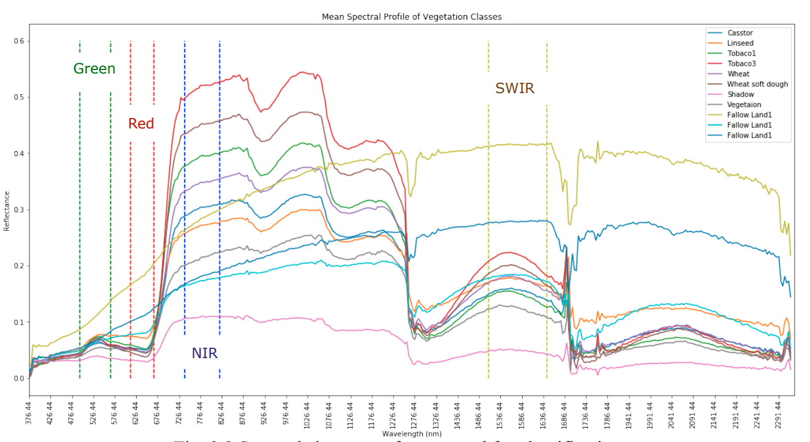
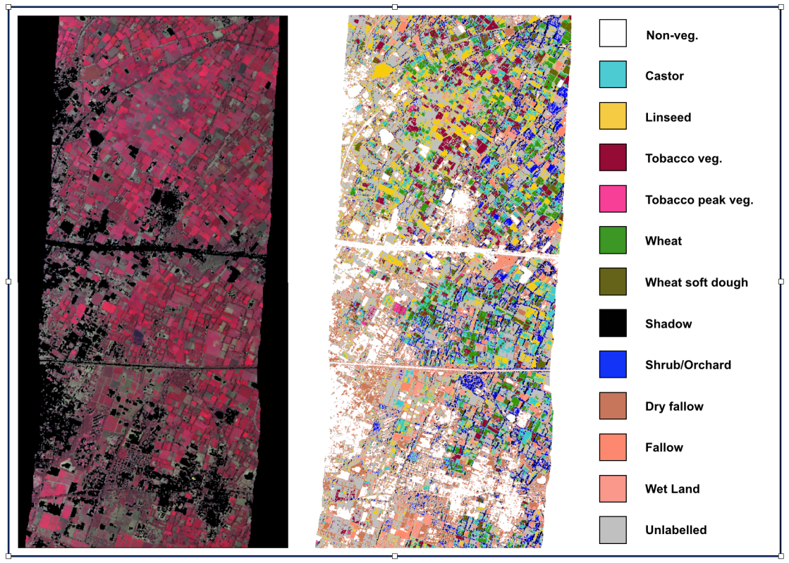
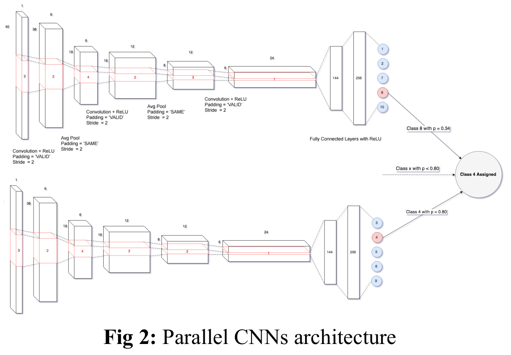
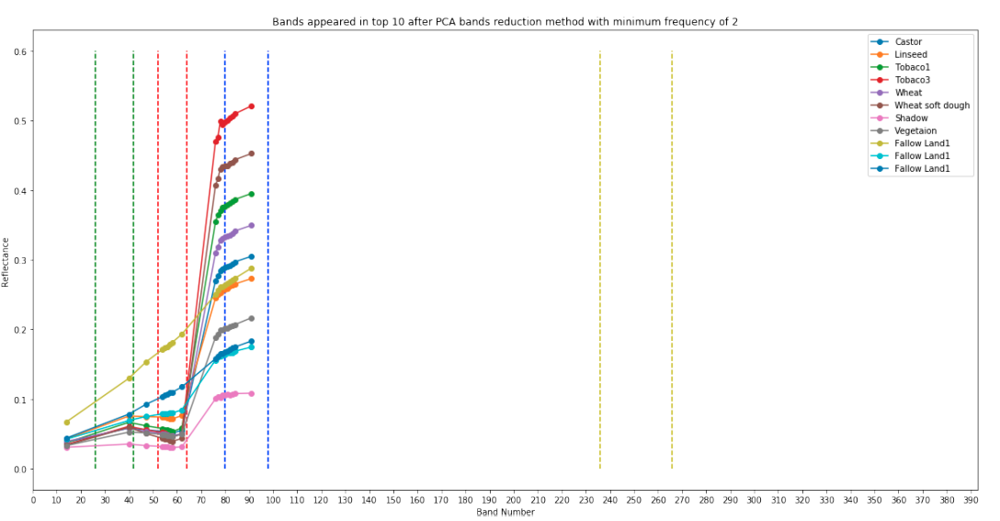
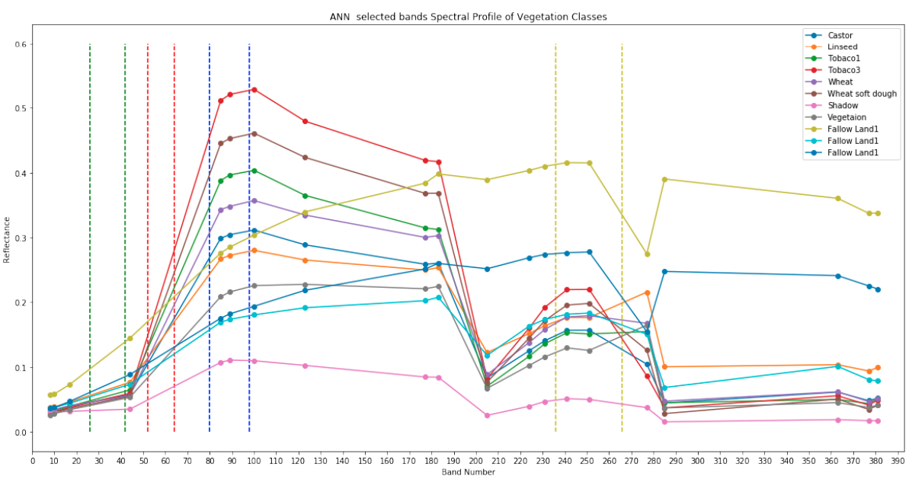
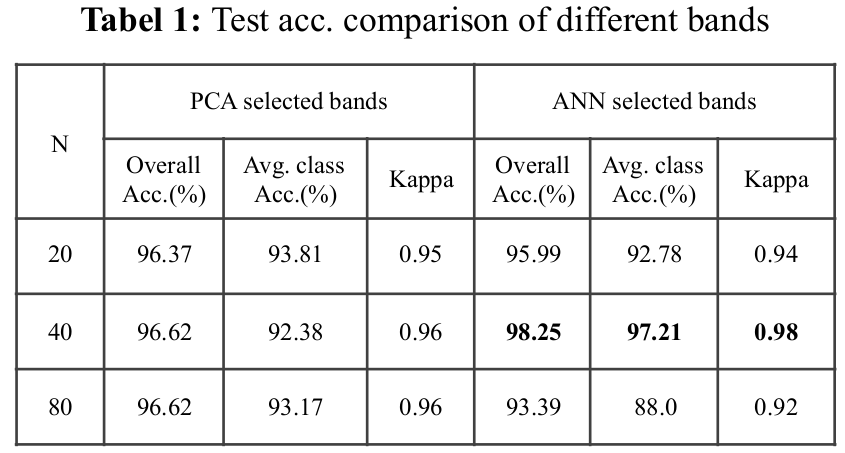

# Hyper Spectral Image Classification

## Code

* [Hyspeclib Library](https://github.com/hetul-patel/hyspeclib)
* [Code Manual](https://drive.google.com/open?id=1hLnw2yNUpvKDbErnlKUZbUSA2DjESjyA)
* [Thesis](https://drive.google.com/open?id=1PQTapftFkTBi9-NZ1ixLuPSGxkn5h-ZB)

## Introduction

Hyperspectral imaging which is also known as imaging
spectroscopy, detects radiation of earth surface features in
narrow contiguous spectral regions of the electromagnetic
spectrum. The Airborne Visible Infrared Imaging
Spectrometer-Next Generation (AVIRIS-NG) is an
airborne hyperspectral sensor of NASA’s Jet Propulsion
Laboratory (JPL) with 425 spectral bands ranging from
380 nm to 2510 nm with a bandwidth of 5 nm and spatial
resolution of 4-6 m. 



This study aims at pixel-wise
identification and discrimination of crop types using
AVIRIS-NG hyperspectral images, with novel Parallel
Convolutional Neural Networks architecture.





To tackle the challenge posed by a large number of correlated
bands, we compare two band selection techniques using
Principal Component Analysis (PCA) and back traversal
of pre-trained Artificial Neural Network (ANN).

* Bands selected by PCA method 


* Bands selected by ANN method


We also propose an automated technique for augmentation of
training dataset with a large number of pixels from
unlabelled parts of an image, based on Euclidian distance.
Experiments show that bands selected by ANN achieve
higher accuracy compare to PCA selected bands with
automated data augmentation.



## Paper

[Crop Identification and Discrimination Using AVIRIS-NG Hyperspectral Data Based on Deep Learning Techniques](https://ieeexplore.ieee.org/abstract/document/8897897)
```
@INPROCEEDINGS{8897897,
  author={Patel, Hetul and Bhagia, Nita and Vyas, Tarjni and Bhattacharya, Bimal and Dave, Kinjal},
  booktitle={IGARSS 2019 - 2019 IEEE International Geoscience and Remote Sensing Symposium}, 
  title={Crop Identification and Discrimination Using AVIRIS-NG Hyperspectral Data Based on Deep Learning Techniques}, 
  year={2019},
  volume={},
  number={},
  pages={3728-3731},
  doi={10.1109/IGARSS.2019.8897897}}
```