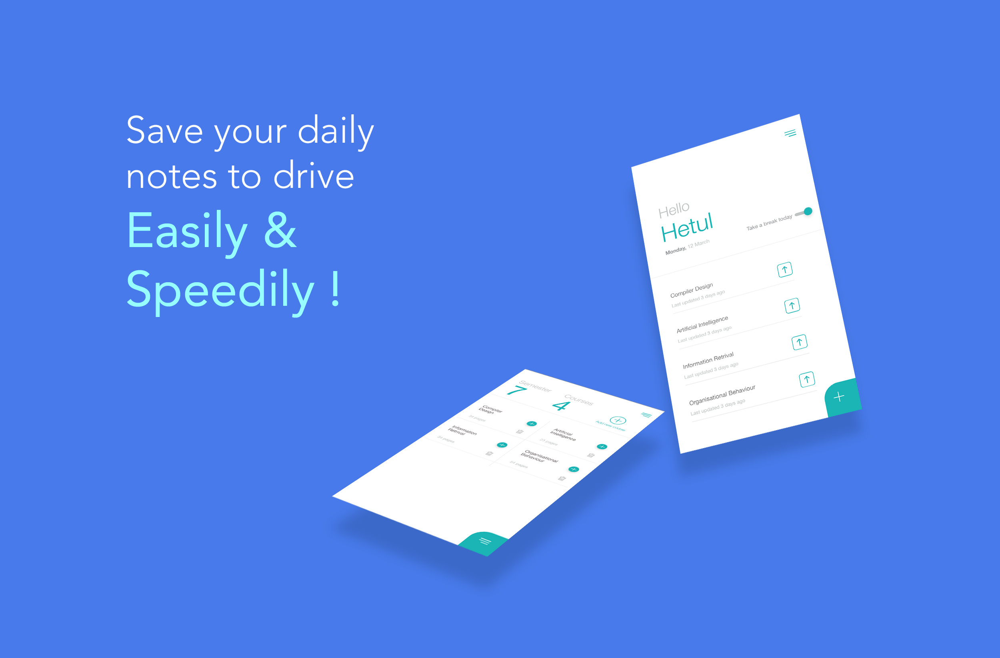
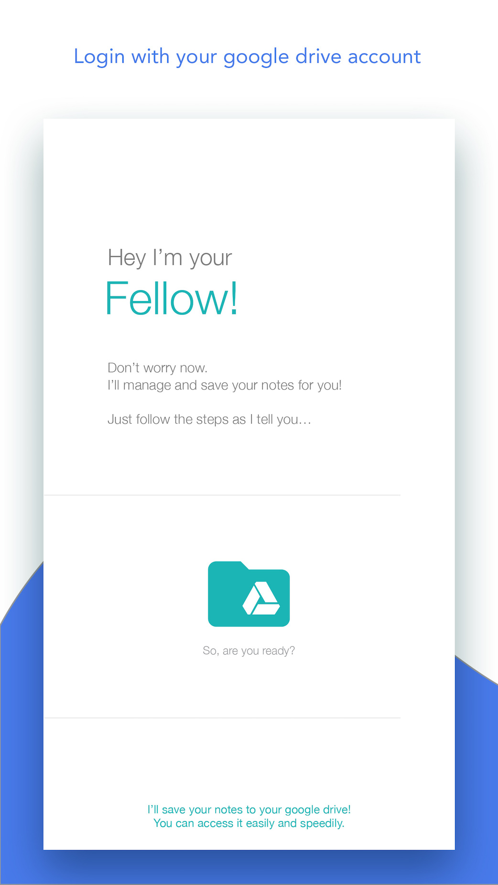
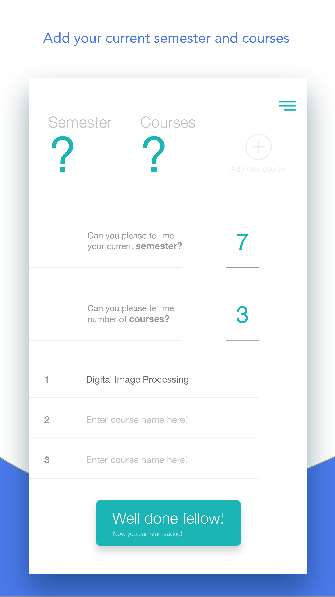
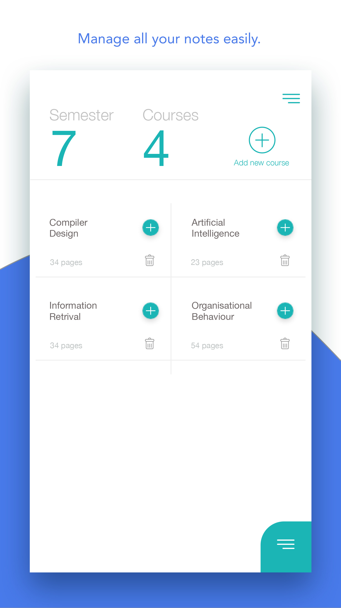
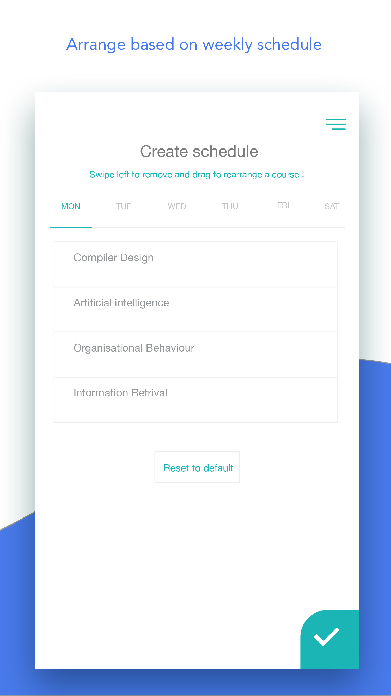
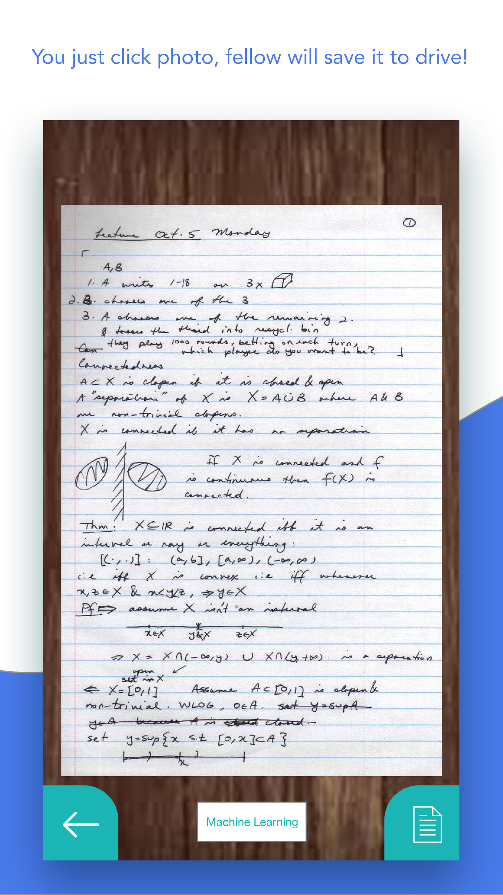

# Fellow (Lecture notes app)

Fellow is an Android app that I built to quickly save my lecture notes into google drive to refer them easily later. Students can quickly click a picture of daily lecture notes for each course. Notes are automatically compiled into a single pdf per course. Some of its feautres are as mentioned below.

## Code

* [Fellow App](https://github.com/hetul-patel/Fellow_App)

## Login with google drive account

User can login with google account so that all the data is backed-up.

## Add semester wise courses

Students can add list of courses enrolled in current semester so that notes can be easily organized and accessed quickly in pdf form by clicking on the subject name.

## Customise home screen

Students can customize the homescreen by adding the weekly schedule of lectures. The home screen will then only show courses planned for the given day. User can quickly add photos of lecture notes for the given course by clicking on the upload button. 

## Navigate easily

Access all the features from the stylish drawer navigation.

