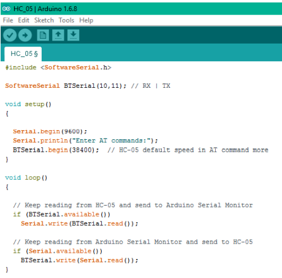

# Mind Controlled Home Automation


## Introduction

Mind Controlled Home Automation System with self-learning capability – an approach to
enter the era of virtual reality, an era where everything is possible. That’s why we named
it as SAMBHAV. The main aim of our project is to control home appliances with human
brain acting as an interface. This means that the signals generated by our brain will now
control electrical appliances – termed as Home Automation. For achieving the same, we
have used MindWave headset that calculates our concentration(attention) and
meditation(relaxation) and even detects the blink. The combination of these human
activities will result into switching ON/OFF devices. 

## About Headset

A closer look at the [headset](https://store.neurosky.com/pages/mindwave):


### Basic functionalities of headset:

* Power Switch – To power ON/OFF the headset. If the switch is held past the ON
position for 3 seconds, the headset will enter the Bluetooth Pairing Mode and if held
past the ON position for 6 seconds, the headset’s pairing memory will be cleared.

* Ear Clip – Acts as the reference point and is clipped at the earlobe (lower part of the
ear).

* Sensor Arm – Core of the headset. It contains the sensor that should be in direct
contact with the forehead. Besides sensor, it also includes the on-board chip that
processes all of the data.

## Working

The biosensor placed inside the headset measures the frequencies of the electrical signals
emitted by the nerve cells. Although neurons are not so good conductor of electricity, yet
they generate electrical signals based on the flow of ions across their plasma membranes.
Basically, neurons generate a negative potential, that is measured by recording the
voltage between the inside and outside of nerve cells. The sensor chip does this work with
ear clip acting as the reference point and the electrical signals measured are commonly
referred to as brainwaves. The sensor chip then amplifies the brainwave signals and
removes the unnecessary noise and muscle movement. These analog signals are then
converted into digital signals by the on-board chip and is being processed to the device.


The table below shows some of the frequencies that tend to be generated by different
types of activity in the brain:

| Brainwave Type | Frequency range | Mental states and conditions                           |
| -------------- | --------------- | ------------------------------------------------------ |
| Delta          | 0.1Hz to 3Hz    | Deep, dreamless sleep, non-REM sleep, unconscious      |
| Theta          | 4Hz to 7Hz      | Intuitive, creative, recall, fantasy, imaginary, dream |
| Alpha          | 8Hz to 12Hz     | Relaxed (but not drowsy) tranquil, conscious           |
| Low Beta       | 12Hz to 15Hz    | Formerly SMR, relaxed yet focused, integrated          |
| Midrange Beta  | 12Hz to 15Hz    | Thinking, aware of self & surroundings                 |
| High Beta      | 21Hz to 30Hz    | Alertness, agitation                                   |

## Android App for analysis

We created an android app for analyzing various signals generated by our brain on
pursuing different activities. App is used to display different EEG band power values such as Delta, Theta, Alpha and Gamma etc.


At the top of the screen, Graph is displayed based on this values and a sudden change in amplitude is detected on blinking. The Attention and Meditation values are also displayed. This app is connected to mindwave headset via Bluetooth. When user go beyond the meditation value of 85, Flash light of the mobile phone automatically gets turned on.

## Controlling Light by Mind : Circuit Diagram 


### Main components of the circuit are:

1. Arduino Uno R3
2. Bluetooth Module HC – 05
3. 4 Channel Relay Module
4. Bulb
5. Power Supply

#### HC-05 Module has 3 pins in use:

1. **VCC** – Connected to Digital Pin 5 of Arduino (5 Volt Supply)
2. **GND** – Connected to Ground Pin of Arduino
3. **Tx** – Transmitter Pin is connected to RX pin of Arduino

#### Relay module has 5 pins in use:

1. **VCC** – Connected to VCC of Arduino (5 Volt Supply)
2. **GND**- Connected to Ground Pin of Arduino
3. **IN2** – As an input pin for relay 2 since we have connected bulb to relay 2. This pin is connected to Digital Pin no. 2 of Arduino.
4. **C** – It is common pin of relay connected to Hot line of 250 V Ac supply.
5. **NO**- Normally open pin is connected to Positive terminal of bulb.

Negative terminal of Bulb is connected to Neutral line of power supply.

Mind wave Head set is wirelessly connected to Arduino via Bluetooth connection.

## Setting up Bluetooth module

HC-05 by default can be paired to any device. But for our project we specifically need to
pair the module with mind wave headset. For that We first turned on our module in
COMMAND MODE by holding a push button provided on top of HC-05. 

To send AT commands to HC-05, we coded the Arduino as shown below and connected
the module to it.



## AT commands for setting up module are listed below:

1. AT+NAME=SAMBHAV: Sets name of Bluetooth device to “Sambhav”

2. AT+UART=57600,0,0: Sets Baud rate to 57600 as mindwave sends data at this
rate.

3. AT+PSWD=0000: “0000” is default password for pairing up with mindwave head
set

4. AT+BIND=MMM,YY,NNNNN: We mentioned the Unique Identifier Number of Our
Headset here which we get from device properties of headset.

## Algorithm

Once the connection is established, mind wave sends the data in 32-byte packet. We need to retrieve the data from packet. Based on the attention and meditation value of mind we can send signal to relay for controlling light.

Packet is described here.

| Byte | Value | Explanation                                                |
| ---- | ----- | ---------------------------------------------------------- |
| 0    | 0xAA  | \[SYNC\] Synchronisation bit                               |
| 1    | 0xAA  | \[SYNC\] Synchronisation bit                               |
| 2    | 0x08  | (payload length) of 8 bytes                                |
| 3    | 0x02  | POOR\_SIGNAL Quality                                       |
| 4    | 0x20  | Some poor signal detected (32/255)                         |
| 5    | 0x01  | BATTERY Level                                              |
| 6    | 0x7E  | Almost full 3V of battery (126/127)                        |
| 7    | 0x04  | ATTENTION                                                  |
| 8    | 0x12  | Attention level of 18%                                     |
| 9    | 0x05  | MEDITATION                                                 |
| 10   | 0x60  | Meditation level of 96%                                    |
| 11   | 0xE3  | \[CHKSUM\] (1's comp inverse of 8-bit Payload sum of 0x1C) |

## Parsing a Packet 

1. Keep reading bytes from the stream until a [SYNC] byte (0xAA) is encountered.

2. Read the next byte and ensure it is also a [SYNC] byte

    * If not a [SYNC] byte, return to step 1.
    * Otherwise, continue to step 3.

3. Read the next byte from the stream as the [PLENGTH].

    * If [PLENGTH] is 170 ([SYNC]), then repeat step 3.
    * If [PLENGTH] is greater than 170, then return to step 1 (PLENGTH TOO LARGE).
    * Otherwise, continue to step 4.

4. Read the next [PLENGTH] bytes of the [PAYLOAD…] from the stream, saving them into a storage area (such as an unsigned char payload [256] array). Sum up each byte as it is read by incrementing a checksum accumulator (checksum += byte).

5. Take the lowest 8 bits of the checksum accumulator and invert them. Here is the C code:

```c
checksum &= 0xFF;
checksum = ~checksum & 0xFF; 
```

6. Read the next byte from the stream as the [CHKSUM] byte.

    * If the [CHKSUM] does not match your calculated chksum (CHKSUM FAILED).
    * Otherwise, you may now parse the contents of the Payload into DataRows to obtain the Data Values, as described below.
    * In either case, return to step 1. 

## Parsing Data Rows in a Packet Payload

Repeat the following steps for parsing a DataRow until all bytes in the payload[] array ([PLENGTH] bytes) have been considered and parsed:

1. Parse and count the number of [EXCODE] (0x55) bytes that may be at the beginning of the current DataRow.
2. Parse the [CODE] byte for the current DataRow.
3. If [CODE] >= 0x80, parse the next byte as the [VLENGTH] byte for the current DataRow.
4. Parse and handle the [VALUE…] byte(s) of the current DataRow, based on the DataRow's [EXCODE] level, [CODE], and [VLENGTH].
5. If not all bytes have been parsed from the payload[] array, return to step 1. to continue parsing the next DataRow.
6. Get Attention Value from [EXCODE] 0x04
7. Get Meditation Value from [EXCODE] 0x05
8. If Attention is greater than threshold, then turn on light else go to step 9.
9. If Meditation is greater than threshold, then turn off light else go to step 1.

## References

1. [Documentation and algorithm for mindwave headset](http://developer.neurosky.com/docs/doku.php?id=thinkgear_communications_protocol)