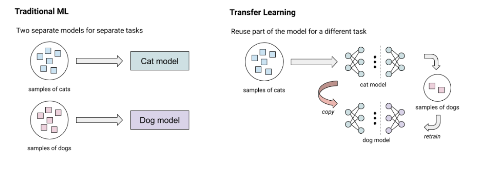
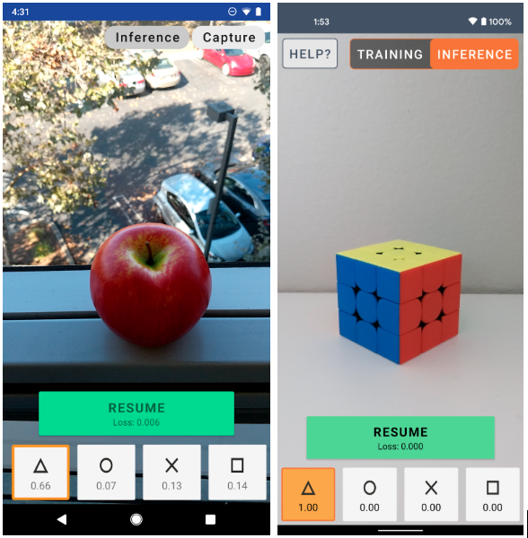
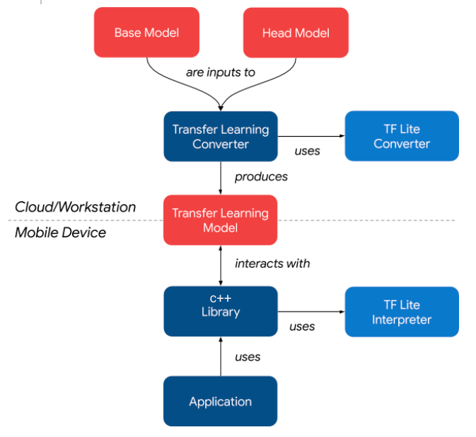

# On-Device Object Classification

## Transfer Learning
Transfer learning is the technique for image classification where we use a pre-trained model trained on large-scale datasets (such as ImageNet) and adapt it for our small number of classes by only retraining the fully connected layer of the model from scratch. 

Generally, training models require powerful CPUs or GPUs. But since the transfer learning technique only requires a small amount of computing to retrain a single layer, we can utilize CPUs/GPUs of modern smartphone devices. That means users can train image classification models on their smartphones on the fly with only as few as 10 images per class. 

## Inspiration

I found this interesting blog in [Example on-device model personalization with TensorFlow Lite
](https://blog.tensorflow.org/2019/12/example-on-device-model-personalization.html) which does something similar. The app uses transfer learning on a quantized MobileNetV2 model pre-trained on ImageNet with the last few layers replaced by a trainable softmax classifier. You can train the last layers to recognize any four new classes.

Since the app was entirely written in java, I redesigned the backend of the app such that the core logic is wrapped inside in an C++ SDK. This SDK is portable such that it can be used on any hardware and os which supports c++ program execution.

## Workflow

The below image explains the workflow of how this app works.

<!-- Introduction
UI Images
exporting models
    back prop
    inference -->
    