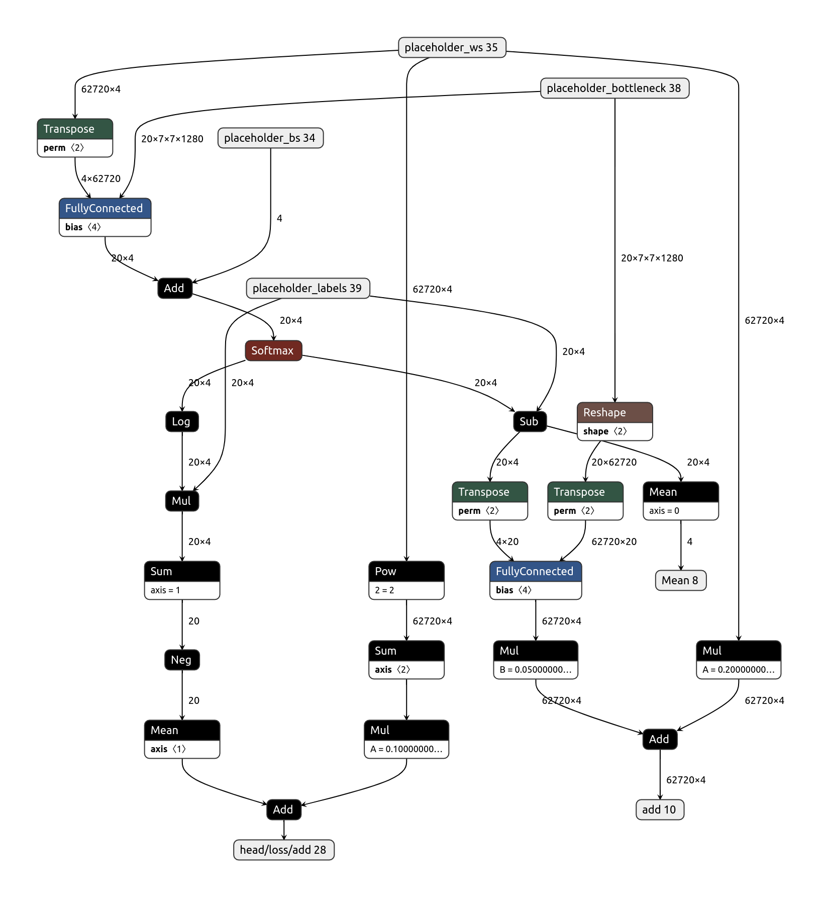
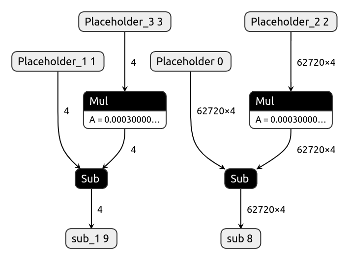
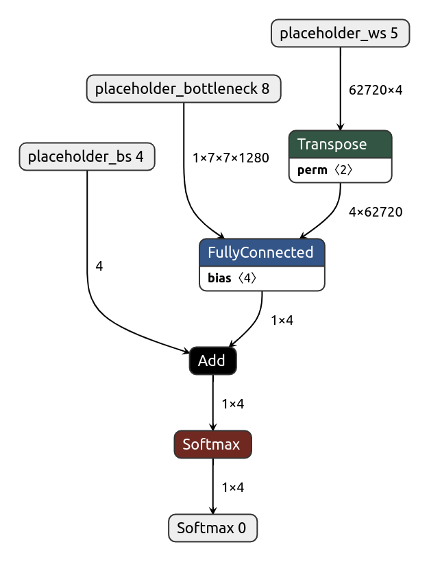

# On-Device Object Classification

## Transfer Learning
Transfer learning is the technique for image classification where we use a pre-trained model trained on large-scale datasets (such as ImageNet) and adapt it for our small number of classes by only retraining the fully connected layer of the model from scratch. 

Generally, training models require powerful CPUs or GPUs. But since the transfer learning technique only requires a small amount of computing to retrain a single layer, we can utilize CPUs/GPUs of modern smartphone devices. That means users can train image classification models on their smartphones on the fly with only as few as 10 images per class. 

## Inspiration

I found this interesting blog in [Example on-device model personalization with TensorFlow Lite
](https://blog.tensorflow.org/2019/12/example-on-device-model-personalization.html) which does something similar. The app uses transfer learning on a quantized MobileNetV2 model pre-trained on ImageNet with the last few layers replaced by a trainable softmax classifier. You can train the last layers to recognize any four new classes.

Since the app was entirely written in java, I redesigned the backend of the app such that the core logic is wrapped inside in a C++ SDK. This SDK is portable such that it can be used on any hardware and os which supports c++ program execution.

## Workflow

The below image explains the workflow of how this app works.

### APIs

The C++ library exposes three functions that any app can use for building on-device classification apps.

#### 1. Add an image
Use can add an image and label to the training set. Internally we store the output of the bottleneck layer generated from the pretrained model.
#### 2. Train model
Randomly shuffles all the embeddings and re-trains the last fully connected layer.
#### 3. Predict an image 
Generates embedding using a pre-trained model and multiplies it with weights of the finetuned fc layer and outputs the final result. 

### Models

There are five different TensorflowLite models to execute the entire flow.

#### 1. bottleneck.tflite (Base model)

Pretrained mobilenet model without the last fully connected layer. It is used for extracting learned features from the input image. For mobile CPUs, we use the fully quantized int8 model and for mobile GPUs, we use the fp16 model.

#### 3. initialize.tflite 

To train our model on custom datasets, the library maintains a weights and biases array in the memory. The `initialize.tflite` model outputs these two matrices initialized with zeros.

#### 2. train_head.tflite

During the training phase, `train_head.tflite` model takes the output of the base model, current weights, current biases, and the ground truth labels. It then calculates the loss and returns gradients of the weights and biases w.r.t the loss. Those gradients are passed to the optimizer model to apply updates. 

#### 4. optimizer.tflite

The optimizer model takes current weights and biases and gradients of weights and biases to apply a gradient descent algorithm (`new_weights = old_weights - learning_rate * gradients`) to calculate new weights and biases. We perform this step after each invocation of the `train_head.tflite` model during the training phase. The library replaces current parameters with the updated parameters in the memory.

#### 5. inference.tflite (Head model)

The inference model takes three inputs, the output of the bottleneck model, the trained weights matrix, and the trained bias values. It calculates the final probability using the `softmax(w*x + b)` formula.

## Extending to object detection

I extended this idea to object detection by using a bottleneck layer of mobilenet-ssd model trained on the COCO dataset and finetuning the bounding box and class prediction layers on the device itself. The primary results were good if there is very change in the test image compared to the training image, but it required more images for the model to produce good results when the test image is taken under different conditions. Though this can be a good future work.  