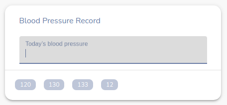

# Hospital Management System

Spry was a hobby project I created for my family doctor. It provides some helpful features for the doctors to manage their patients' data through this web app.

## Responsive Dashboard

## List of features

### 1. Add symptoms and treatments

### 2. Track patient's blood pressure history.

### 3. Track paid and unpaid amount.

### 4. Create unique patient profile

### 5. Check patient's medical history.

### 6. Search patients by multiple fields.

### 7. Real time sync with cloud
